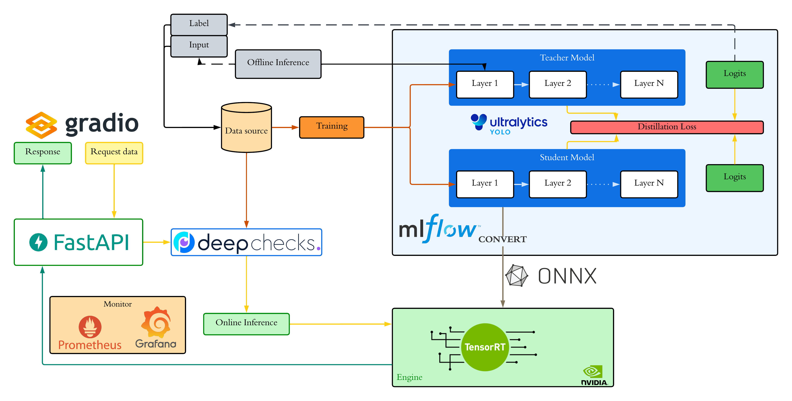

# HPC_Nhom1_MLOps_ObjectDetection

**Tối ưu triển khai mô hình phát hiện đối tượng thời gian thực bằng nén mô hình, Docker và HPC**

Repository này là project nhóm cho học phần **Tính toán hiệu suất cao**. Mục tiêu là xây dựng lại một pipeline MLOps cho bài toán traffic object detection, trong đó mô hình YOLO được huấn luyện theo hướng teacher-student Knowledge Distillation, sau đó đóng gói thành hệ thống inference bằng FastAPI, Gradio và Docker.

## Mục Tiêu

- Huấn luyện mô hình teacher YOLO cho bài toán phát hiện đối tượng giao thông.
- Huấn luyện mô hình student nhỏ hơn bằng Knowledge Distillation.
- So sánh teacher, student baseline và student KD theo `mAP`, latency, FPS và kích thước model.
- Xuất artifact `.pt` và tùy chọn `.onnx`/TensorRT phục vụ inference.
- Triển khai API object detection bằng FastAPI.
- Xây dựng giao diện demo bằng Gradio.
- Đóng gói hệ thống bằng Docker Compose.
- Theo dõi experiment/model bằng MLflow và MinIO.
- Chuẩn bị monitoring stack với Prometheus, Grafana, Loki và Alertmanager.

## Pipeline Tổng Quan

Pipeline gốc của hệ thống production gồm data source, training, distillation, MLflow, Deepchecks, FastAPI, Gradio, monitoring và tối ưu inference bằng ONNX/TensorRT.



Trong điều kiện thực nghiệm của nhóm, phần training có thể được tách ra chạy offline trên Google Colab để tận dụng GPU. Sau khi train xong, các artifact như `teacher_best.pt`, `student_best.pt`, `student_kd_best.pt` và `serving_model.pt` được tải về rồi đưa vào serving pipeline.

## Kiến Trúc Chính

```text
Kaggle Dataset
  -> Data Pipeline
  -> Teacher Training
  -> Student Baseline Training
  -> Student Knowledge Distillation
  -> Model Artifacts (.pt / .onnx)
  -> FastAPI Inference Service
  -> Gradio Demo UI
  -> Docker Compose Deployment
  -> Monitoring / Drift Detection
```

## Cấu Trúc Repository

```text
hpc_nhom1_code/
├── assets/
│   └── full_pipeline.png
├── data_pipeline/
│   ├── __main__.py
│   ├── kaggle_download.py
│   ├── subset_creator.py
│   ├── test_variants.py
│   └── version_manager.py
├── data_validation/
│   ├── dataset_loader.py
│   ├── drift_analysis.py
│   └── generate_predictions.py
├── infra/
│   ├── airflow/
│   ├── mlflow/
│   └── monitor/
├── notebooks/
│   ├── colab_train.ipynb
│   └── trainer.py
├── scripts/
│   ├── train_teacher_model.py
│   └── send_drift_data.py
├── serving_pipeline/
│   ├── api/
│   ├── docker/
│   ├── models/
│   ├── utils/
│   ├── gradio_app.py
│   └── docker-compose.yml
├── training_pipeline/
│   └── src/
│       ├── train.py
│       └── config/train.yaml
└── README.md
```

## Thành Phần Chính

### Data Pipeline

Module `data_pipeline` hỗ trợ:

- tải dataset từ Kaggle;
- tổ chức dataset về cấu trúc YOLO;
- tạo subset để demo/training nhanh;
- tạo test variants như brightness, blur, noise, fog;
- upload/download version dataset qua MinIO.

### Training Pipeline

Nhóm dùng 3 nhánh training:

- **Teacher model**: YOLO lớn hơn, đóng vai trò mô hình tham chiếu.
- **Student baseline**: YOLO nhỏ hơn, train trực tiếp từ label gốc.
- **Student KD**: YOLO nhỏ hơn, học thêm từ teacher thông qua Knowledge Distillation.

Script chính:

```text
scripts/train_teacher_model.py
training_pipeline/src/train.py
notebooks/colab_train.ipynb
```

### Serving Pipeline

`serving_pipeline` cung cấp:

- FastAPI backend;
- endpoint `/detect` cho inference CPU;
- endpoint `/detect-gpu` nếu môi trường có CUDA;
- endpoint `/detect-tensorrt` nếu đã có TensorRT engine;
- Gradio UI để upload ảnh và xem bounding boxes;
- Dockerfile backend/UI;
- Docker Compose cho service API/UI.

### Infrastructure

`infra` gồm:

- `infra/mlflow`: MLflow + MinIO cho experiment tracking và artifact storage.
- `infra/airflow`: Airflow DAGs cho training, drift detection và TensorRT conversion.
- `infra/monitor`: Prometheus, Grafana, Loki và Alertmanager.

## Cài Đặt Nhanh

### 1. Clone repository

```bash
git clone https://github.com/hoaianthai345/HPC_Nhom1_MLOps_ObjectDectection.git
cd HPC_Nhom1_MLOps_ObjectDectection
```

### 2. Tạo Python environment

```bash
python3 -m venv venv
source venv/bin/activate
pip install --upgrade pip
pip install -r data_pipeline/requirements.txt
pip install -r serving_pipeline/requirements.txt
pip install ultralytics mlflow pyyaml boto3
```

### 3. Tạo Docker network

```bash
docker network create hpc-nhom1-network
```

Nếu network đã tồn tại thì có thể bỏ qua.

### 4. Khởi động MLflow và MinIO

```bash
cd infra/mlflow
cp .env.example .env
docker compose up -d
cd ../..
```

Truy cập:

- MLflow: http://localhost:5000
- MinIO: http://localhost:9001

### 5. Khởi động monitoring stack

```bash
cd infra/monitor
docker compose up -d
cd ../..
```

Truy cập:

- Prometheus: http://localhost:9090
- Grafana: http://localhost:3000
- Loki: http://localhost:3100

## Training Bằng Google Colab

Trong điều kiện nhóm chưa có GPU local/HPC, cách khuyến nghị là dùng notebook:

```text
notebooks/colab_train.ipynb
```

Notebook này thực hiện:

1. Clone repository project từ GitHub.
2. Clone fork `ultralytics-kd`.
3. Copy `notebooks/trainer.py` vào `ultralytics/engine/trainer.py`.
4. Cài `ultralytics-kd` ở chế độ editable.
5. Upload `kaggle.json`.
6. Tải dataset từ Kaggle.
7. Tạo subset YOLO nếu cần.
8. Train teacher YOLO.
9. Train student baseline.
10. Train student bằng Knowledge Distillation.
11. Validate model.
12. Xuất artifact `.pt` và tùy chọn `.onnx`.

Artifacts sau khi train:

```text
teacher_best.pt
student_best.pt
student_kd_best.pt
serving_model.pt
serving_model.onnx  # optional
```

`serving_model.pt` là file chính để đưa vào FastAPI/Gradio.

## Training Local

### Train teacher

```bash
python scripts/train_teacher_model.py \
  --data data/demo_subset/data.yaml \
  --model yolo11x.pt \
  --epochs 50 \
  --batch 16 \
  --imgsz 640 \
  --device 0 \
  --project runs/teacher \
  --name teacher_yolo \
  --no-mlflow
```

### Train student baseline

```bash
yolo detect train \
  model=yolo11n.pt \
  data=data/demo_subset/data.yaml \
  epochs=50 \
  imgsz=640 \
  batch=16 \
  device=0 \
  project=runs/student_baseline \
  name=student_yolo
```

### Train student với Knowledge Distillation

```bash
python training_pipeline/src/train.py \
  training_pipeline/src/config/train.yaml \
  --teacher-weights runs/teacher/teacher_yolo/weights/best.pt \
  --student-weights yolo11n.pt \
  --data data/demo_subset/data.yaml \
  --mlflow-tracking-uri http://localhost:5000 \
  --mlflow-experiment traffic-distillation \
  --mlflow-run-name student_kd
```

Lưu ý: KD cần bản `ultralytics-kd` đã được patch bằng `notebooks/trainer.py`.

## Chạy Serving Demo

Copy model đã train vào repo:

```bash
cp /path/to/serving_model.pt ./serving_model.pt
```

Chạy API và UI:

```bash
cd serving_pipeline
docker compose up -d api ui
```

Truy cập:

- FastAPI docs: http://localhost:8000/docs
- Gradio UI: http://localhost:7860

Nếu chạy GPU/TensorRT:

```bash
cd serving_pipeline
docker compose --profile gpu up -d
```

## API Chính

### Health check

```http
GET /health
```

### Object detection

```http
POST /detect
```

Input:

- image file: `.jpg`, `.jpeg`, `.png`, `.bmp`, `.webp`
- optional query params: `confidence_threshold`, `iou_threshold`

Output:

```json
{
  "request_id": "abc123",
  "num_detections": 3,
  "image_size": {
    "width": 1280,
    "height": 720
  },
  "inference_time_ms": 25.4,
  "detections": [
    {
      "bbox": {
        "x1": 100.0,
        "y1": 120.0,
        "x2": 300.0,
        "y2": 360.0,
        "width": 200.0,
        "height": 240.0,
        "center_x": 200.0,
        "center_y": 240.0
      },
      "confidence": 0.91,
      "class_id": 2,
      "class_name": "car"
    }
  ]
}
```


## Ghi Nhận Nguồn Tham Khảo

Repository này được nhóm chỉnh sửa và triển khai lại cho đề tài học phần từ project tham khảo:

- Original reference repository: `https://github.com/ThuanNaN/aio2025-mlops-project02`
- Nội dung tham khảo chính: MLOps pipeline cho traffic detection, data pipeline, training/serving structure, MLflow/MinIO/Airflow/monitoring setup và ý tưởng Knowledge Distillation cho YOLO.

Nhóm đã điều chỉnh lại repository theo phạm vi đề tài **HPC_Nhom1_MLOps_ObjectDetection**, bổ sung notebook Colab training, custom KD trainer, serving model wrapper, tài liệu báo cáo/slide và pipeline thực nghiệm phù hợp với điều kiện triển khai của nhóm.
